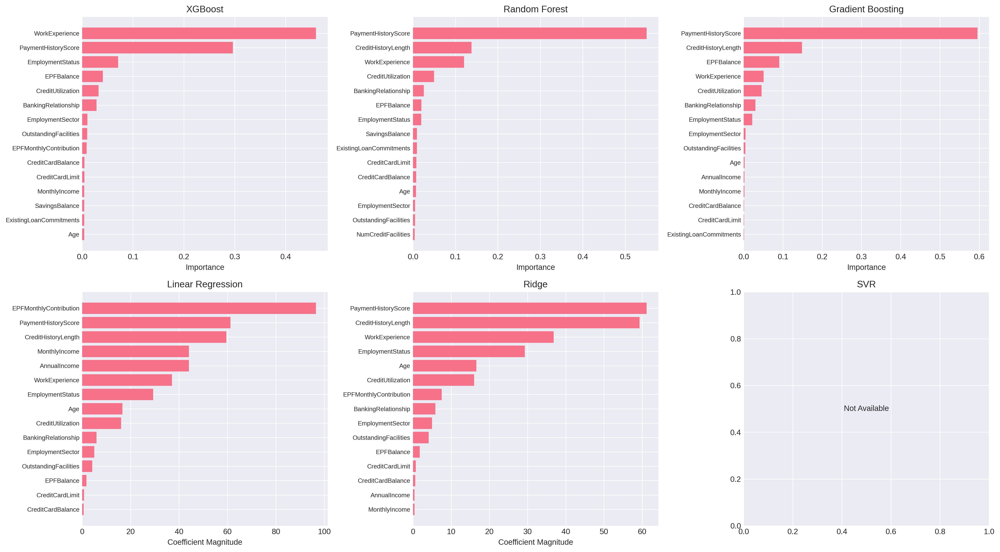
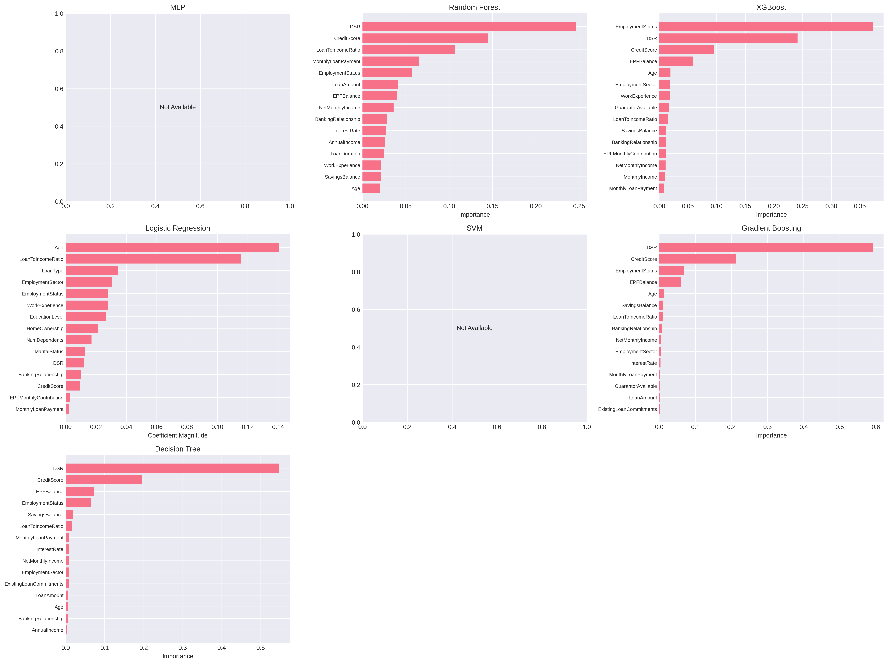
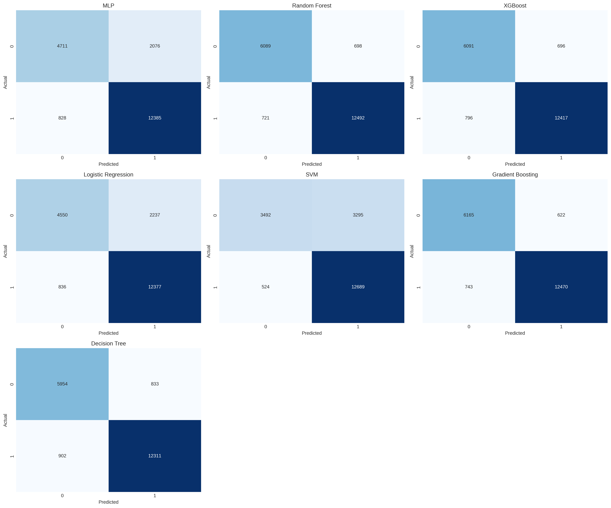
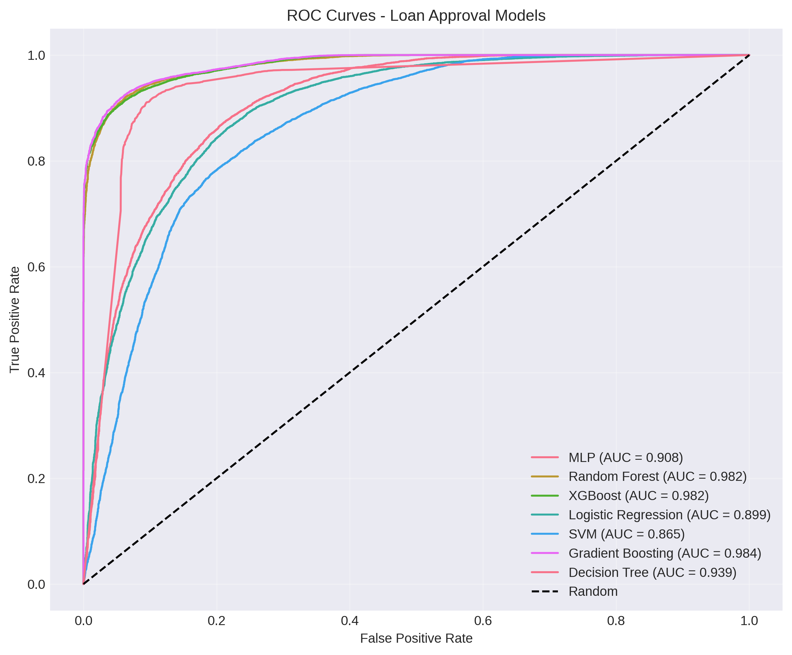
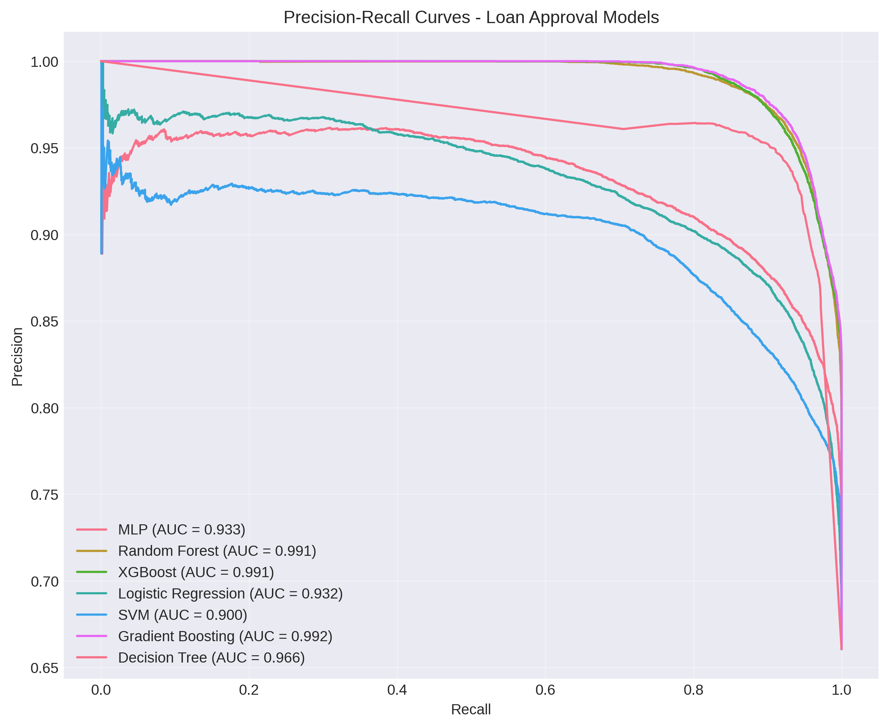

# Loan Approval and Credit Scoring Models Comparison

This is a part of my final year project, in which I build an automatic loan approval app and AI-credit scoring system. I compare multiple machine learning models and choose the best performing model for each use case. The data is synthetically generated according to Malaysian banking logic.

## Project Overview

The `auto_loan_models.ipynb` notebook implements and compares various machine learning models for two primary tasks:

1. **Credit Score Prediction** (Regression Task)
2. **Loan Approval Prediction** (Classification Task)

## Dataset

The project uses two synthetically generated datasets based on Malaysian banking practices:

- **Credit Scoring Data**: 100,000 records with 27 features
- **Loan Approval Data**: 100,000 records with 29 features

Both datasets include various financial, demographic, and employment-related features.

## Workflow and Processes

### 1. Data Loading and Preprocessing

#### Credit Scoring Data Preprocessing
- **Features Used**: 23 features after dropping `ApplicationDate`, `CreditScoreCategory`, `CreditScore`, and `CCRISStatus`
- **Target Variable**: `CreditScore` (continuous value between 300-850)
- **Categorical Features** (Label Encoded):
  - EmploymentStatus, EmploymentSector, EducationLevel, MaritalStatus, HomeOwnership
- **Numerical Features** (Standardized):
  - Age, MonthlyIncome, AnnualIncome, WorkExperience, EPFMonthlyContribution, EPFBalance, NumCreditFacilities, OutstandingFacilities, CreditCardLimit, CreditCardBalance, CreditUtilization, ExistingLoanCommitments, PaymentHistoryScore, CreditHistoryLength, BankingRelationship, NumDependents, SavingsBalance, OwnsProperty
- **Train/Test Split**: 80,000 training samples / 20,000 test samples

#### Loan Approval Data Preprocessing
- **Features Used**: 26 features after dropping `ApplicationDate`, `CreditScoreCategory`, and `LoanApproved`
- **Target Variable**: `LoanApproved` (binary: 0 or 1)
- **Categorical Features** (Label Encoded):
  - EmploymentStatus, EmploymentSector, EducationLevel, LoanType, MaritalStatus, HomeOwnership
- **Train/Test Split**: 80,000 training samples / 20,000 test samples (stratified)
- **Approval Rate**: ~66%

### 2. Model Training and Evaluation

#### Credit Score Prediction Models (Regression)

Six regression models were trained and evaluated:

1. **Gradient Boosting** - Best performing model
   - MAE: 23.84, RMSE: 29.92, R²: 0.8778
2. **XGBoost**
   - MAE: 24.40, RMSE: 30.61, R²: 0.8721
3. **Random Forest**
   - MAE: 24.57, RMSE: 30.83, R²: 0.8702
4. **SVR (Support Vector Regression)**
   - MAE: 25.48, RMSE: 32.07, R²: 0.8596
5. **Ridge Regression**
   - MAE: 26.33, RMSE: 33.17, R²: 0.8498
6. **Linear Regression**
   - MAE: 26.33, RMSE: 33.17, R²: 0.8498

**Winner**: Gradient Boosting with the highest R² score of 0.8778

*Figure 1: Feature importance analysis for credit scoring models showing which factors most influence credit score predictions.*

#### Loan Approval Prediction Models (Classification)

Seven classification models were trained and evaluated:

1. **Gradient Boosting** - Best performing model
   - Accuracy: 93.18%, ROC-AUC: 0.9838, F1: 0.9481, Precision: 95.25%, Recall: 94.38%
2. **Random Forest**
   - Accuracy: 92.91%, ROC-AUC: 0.9817, F1: 0.9463, Precision: 94.71%, Recall: 94.54%
3. **XGBoost**
   - Accuracy: 92.54%, ROC-AUC: 0.9821, F1: 0.9433, Precision: 94.69%, Recall: 93.98%
4. **Decision Tree**
   - Accuracy: 91.33%, ROC-AUC: 0.9385, F1: 0.9342, Precision: 93.66%, Recall: 93.17%
5. **MLP (Neural Network)**
   - Accuracy: 85.48%, ROC-AUC: 0.9077, F1: 0.8951, Precision: 85.64%, Recall: 93.73%
6. **Logistic Regression**
   - Accuracy: 84.64%, ROC-AUC: 0.8989, F1: 0.8896, Precision: 84.69%, Recall: 93.67%
7. **SVM (Support Vector Machine)**
   - Accuracy: 80.91%, ROC-AUC: 0.8652, F1: 0.8692, Precision: 79.39%, Recall: 96.03%

**Winner**: Gradient Boosting with the highest ROC-AUC score of 0.9838

*Figure 2: Feature importance analysis for loan approval models revealing key factors in loan approval decisions.*

### 3. Model Performance Visualization

#### Confusion Matrix

*Figure 3: Confusion matrices for all loan approval models showing the distribution of correct and incorrect predictions.*

#### ROC Curves

*Figure 4: ROC (Receiver Operating Characteristic) curves comparing the performance of all loan approval models. Higher AUC indicates better model performance.*

#### Precision-Recall Curves

*Figure 5: Precision-Recall curves showing the trade-off between precision and recall for each loan approval model.*

## Key Findings

### Credit Scoring
- **Gradient Boosting** achieved the best performance with an R² of 0.8778
- Ensemble methods (Gradient Boosting, XGBoost, Random Forest) significantly outperformed linear models
- The model can predict credit scores with an average error of ~24 points

### Loan Approval
- **Gradient Boosting** again proved to be the best model with 93.18% accuracy and 0.9838 ROC-AUC
- All tree-based ensemble methods achieved over 92% accuracy
- High precision (95.25%) ensures minimal false approvals
- High recall (94.38%) ensures most eligible applicants are approved

## Model Selection

Based on comprehensive evaluation:
- **Credit Scoring**: Gradient Boosting Regressor
- **Loan Approval**: Gradient Boosting Classifier

Both selected models provide the best balance of accuracy, reliability, and interpretability for deployment in a production banking system.
